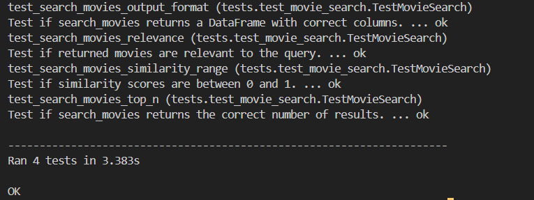

# Movie Semantic Search Assignment

**Submitted By:**
- **Name:** Adarsh Manjunath Naik
- **Roll Number:** 221010202
- **Branch:** ECE

---

This repository contains a semantic search engine for movie plots, built for the AI Systems Development assignment. It uses Python and the `all-MiniLM-L6-v2` sentence transformer model to find movies with plots that are semantically similar to a user's search query.

---

## Setup Instructions

Follow these steps to set up and run the project locally.

1.  **Clone the Repository:**
    ```bash
    git clone https://github.com/adarsh-naik-2004/ai-systems-development-assignment.git
    cd ai-systems-development-assignment
    ```

2.  **Create and Activate Virtual Environment:**
    ```bash
    # Create the environment
    python -m venv venv

    # Activate on Windows
    venv\Scripts\activate

    # Activate on macOS/Linux
    source venv/bin/activate
    ```

3.  **Install Dependencies:**
    ```bash
    pip install -r requirements.txt
    ```

---

## Running the Unit Tests

To verify that the search function is working correctly, run the unit tests from the project's root directory. The `discover` command will automatically find and run all tests.

```bash
python -m unittest discover
```


## Usage
### 1. Interactive Notebook

You can execute the cells in the notebook to perform a search and see the results.
```bash
semantic_search_movie_plot.ipynb
```
### 2. Direct Import
The core logic is in the search_movies() function in movie_search.py file. You can import and use it in any Python script.
#### Example - 
```bash
from movie_search import search_movies

# Find the top 5 movies related to a 'spy thriller in Paris'
results = search_movies('spy thriller in Paris', top_n=5)

# Print the titles, plots, and similarity scores of the results
print(results[['title', 'plot', 'similarity']])
```
